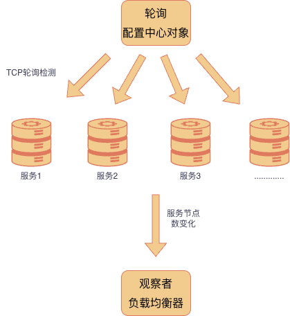

# gogate 网关
> gogate 是一个基于 Go 语言开发的轻量级微服务网关，提供 HTTP/HTTPS 代理、TCP 代理、服务治理、流量控制等核心能力，支持通过可视化后台进行配置管理


## 核心功能
* 多协议支持：HTTP/HTTPS 代理、TCP 代理
* 服务治理：基于配置的服务路由、负载均衡
* 流量统计：实时统计全站流量、单个服务流量、按天/小时流量
* 流量控制：QPS/QPD 限流、IP 白名单
* 可视化管理：内置 dashboard 管理后台，支持服务配置、租户管理
* 高可用：基于 Redis 实现分布式会话和缓存

## 技术架构
Gin、Redis、MySQL、Gorm


## 流量统计的实现
### 实现技术栈
> 通过 Redis + 原子计数 + 定时任务 实现了高性能的请求流量统计与实时 QPS（每秒请求数）计算
核心结构：RedisFlowCountService
```go
type RedisFlowCountService struct {
	AppID       string
	Interval    time.Duration		// 统计间隔：定时持久化到Redis、计算QPS的周期（如1秒、5秒）
	QPS         int64
	Unix        int64
	TickerCount int64
	TotalCount  int64
}
```
1. 原子计数：每当有请求到达时，原子增加`TickerCount`，记录当前周期内的请求数。
2. 定时任务：在每次定时周期结束时，原子读取`TickerCount`并重置，并计算当前周期内的QPS（`TickerCount / Interval`），更新到`QPS`字段。
3. 总流量统计：原子增加`TotalCount`，记录所有请求的累计数量。

### 实现要点总结
1. 使用 atomic 原子操作 保证并发安全
2. 利用 Redis Pipeline 提升批量写入性能
3. 定时器（time.Ticker）实现异步统计与QPS计算

### key设计
> 系统在 Redis 中维护两种维度的流量统计 key：按天 和 按小时
* 按天统计： flow_day_{YYYYMMDD}_{AppID}
* 按小时统计： flow_hour_{YYYYMMDDHH}_{AppID}

### 本系统的流量统计功能：
* 统计全站流量
* 统计单个服务流量


## 限流实现
> 该模块基于 Go 官方库 golang.org/x/time/rate 实现限流
每个服务（以及每个客户端 IP）对应一个独立的 rate.Limiter 实例，通过令牌桶算法控制请求速率，防止流量突发。

通过map存储，也就是说基于内存的限流, 适用于：
* 单机部署、或者每个节点独立限流
* 性能最高（没有网络开销）通信快

后期如果需要分布式限流，则可以基于redis实现


## 负载均衡
实现：轮询、加权轮询、IP哈希三种方式的负载均衡
基于**观察者模式**：
* 主题（Subject）：负载均衡配置中心
* 观察者（Observer）： LoadBalance 实例

配置中心运行协程：每隔一定时间（如5秒）进行节点存活检测，更新节点状态（健康/不健康）。
如果存活列表有变化，则通知所有 LoadBalance 实例更新节点列表进行更新：



###  负载均衡器抽象
```go
type LoadBalance interface {
	Add(...string) error			// 添加节点addr
	Get(string) (string, error)		// 根据key获取下一个节点addr

	//后期服务发现补充
	Update()
}
```
参数举例：
```go
lb := NewRoundRobinBalance()
lb.Add("10.0.0.1:80", "0")		// 地址 & 权重
```

1. 随机负载均衡器
	* 即随机选择一个节点

2. 轮询负载均衡器
	* 即按顺序选择下一个节点，每次获取节点后，将索引+1，超过节点列表长度时，重新从0开始

3. 加权轮询负载均衡器
	* 即按权重比例选择下一个节点，权重越高，被选中的概率越大

4. IP哈希负载均衡器
	* 即根据客户端 IP 进行哈希计算，将相同 IP 的请求路由到相同的节点


## 连接池
每个服务（ServiceName）对应一个独立的 http.Transport 实例，用于维护到后端节点的 TCP 连接池
同一服务的所有客户端请求共享同一套 TCP 连接池，极大减少建连（TCP+TLS）开销，显著提升 QPS
```go
type Transportor struct {
	TransportMap   map[string]*TransportItem
	TransportSlice []*TransportItem
	Locker         sync.RWMutex
}

type TransportItem struct {
	Trans       *http.Transport
	ServiceName string
}
	trans := &http.Transport{
		Proxy: http.ProxyFromEnvironment,
		DialContext: (&net.Dialer{
			Timeout: time.Duration(service.LoadBalance.UpstreamConnectTimeout)*time.Second,
			KeepAlive: 30 * time.Second,
			DualStack: true,
		}).DialContext,
		ForceAttemptHTTP2:     true,
		MaxIdleConns:          service.LoadBalance.UpstreamMaxIdle,
		IdleConnTimeout:       time.Duration(service.LoadBalance.UpstreamIdleTimeout)*time.Second,
		TLSHandshakeTimeout:   10 * time.Second,
		ResponseHeaderTimeout: time.Duration(service.LoadBalance.UpstreamHeaderTimeout)*time.Second,
	}
```


## 压测环境
* 压测工具：wrk
* 压测机器： MacBook air M2， 8核16GB
* 压测服务端： 本地部署的 gogate 网关 + 本地部署的 test_http_1 服务(仅进行字符串打印，开发端口：2003 2004)

说明：
由于机器限制，压测服务端仅部署在本地，压测客户端也在本地；
网关与服务之间网络通信开销更小，不符合真实场景；
所以压测结果仅代表本地环境的性能表现，不具有普遍性。

## 压测结果
在相同压测条件（30 线程、600 并发、30s）下，对比原服务与通过网关访问的性能差异如下：
**吞吐量**
* 原服务：184,109 req/s
* 网关代理后：112,672 req/s
* **吞吐量下降约 38.8%**

**延迟**
* 原服务：3.3ms
* 网关代理后：39.7ms
* **延迟增加约12倍**

## 压测数据
### 对原服务进行压力测试
```bash
(base) xing@xing-2 gogate % wrk -t30 -c600 -d30s --latency http://127.0.0.1:2003/test
Running 30s test @ http://127.0.0.1:2003/test
  30 threads and 600 connections
  Thread Stats   Avg      Stdev     Max   +/- Stdev
    Latency     3.30ms    1.80ms  69.96ms   94.37%
    Req/Sec     6.17k   526.18    14.21k    89.21%
  Latency Distribution
     50%    3.13ms
     75%    3.59ms
     90%    4.11ms
     99%    7.67ms
  5533725 requests in 30.06s, 791.61MB read
Requests/sec: 184109.72
Transfer/sec:     26.34MB
```

### 经过网关层代理后的压力测试
```bash
(base) xing@xing-2 nginx % wrk -t30 -c600 -d30s --latency http://127.0.0.1:8080/test_http_1/test
Running 30s test @ http://127.0.0.1:8080/test_http_1/test
  30 threads and 600 connections
  Thread Stats   Avg      Stdev     Max   +/- Stdev
    Latency    42.47ms   66.43ms 886.17ms   84.39%
    Req/Sec     3.83k     1.53k   11.99k    69.97%
  Latency Distribution
     50%    2.30ms
     75%   67.33ms
     90%  139.39ms
     99%  282.98ms
  3433934 requests in 30.04s, 785.72MB read
Requests/sec: 114300.74
Transfer/sec:     26.15MB

```


